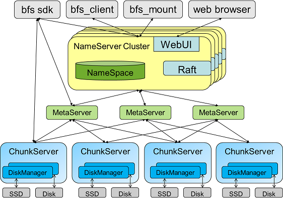

[The Baidu File System](http://github.com/baidu/bfs)
======

    

The Baidu File System (BFS) is a distributed file system designed to support real-time applications. Like many other distributed file systems, BFS is highly fault-tolerant. But different from others, BFS provides low read/write latency while maintains high throughout rates. Together with [Galaxy](https://github.com/baidu/galaxy) and [Tera](http://github.com/baidu/tera), BFS supports many real-time products in Baidu, including Baidu webpage database, Baidu incremental indexing system, Baidu user behavior analysis system, etc.

百度的核心业务和数据库系统都依赖分布式文件系统作为底层存储，文件系统的可用性和性能对上层搜索业务的稳定性与效果有着至关重要的影响。现有的分布式文件系统（如HDFS等）是为离线批处理设计的，无法在保证高吞吐的情况下做到低延迟和持续可用，所以我们从搜索的业务特点出发，设计了百度文件系统。

## Features
1. Continuous Availability  
数据多机房、多地域冗余，元数据通过Raft维护一致性，单个机房宕机，不影响整体可用性。
2. High Throughput、Low Latency 
通过高性能的单机引擎，最大化存储介质IO吞吐；通过全局副本、流量调度，实现负载均衡。
3. Scalability  
设计支持两地三机房，1万+台机器管理。

## Architecture
系统主要由NameServer、ChunkServer、SDK和bfs_client等几个模块构成。  
其中NameServer是中心控制模块，负责目录树的管理；ChunkServer是数据节点负责提供文件块的读写服务；SDK以静态库的形式提供了用户使用的API；bfs_client是一个二进制的管理工具。  

## Quick Start
#### Build  
sh build.sh  
#### Standalone BFS
cd sandbox; sh deploy.sh sh start.sh

## Contributing
阅读RoadMap，了解我们当前的发展方向，然后提pull request就可以了

## Contact us
opensearch@baidu.com

